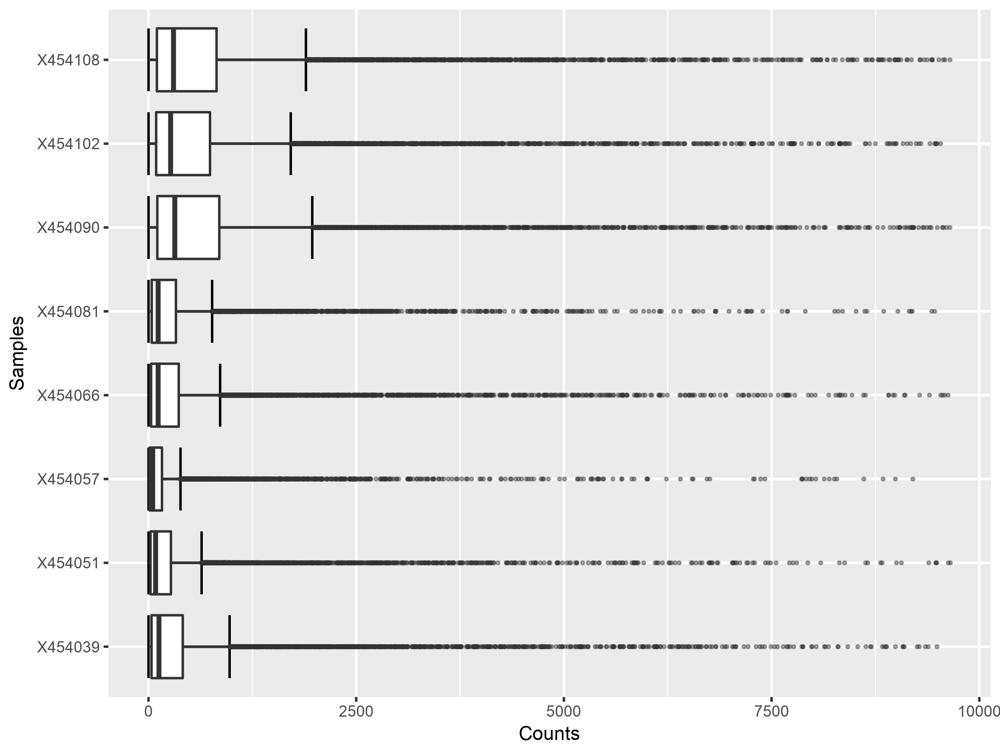

# Box Plot
The box plot is a descriptive statistics tool that graphically illustrates the distribution of numerical data measures accross set of samples. For each box plot corresponding to a single sample, five lines would represent summary of five numbers including: minimum, first quartile (or 25th percentile), median, third quartile (or 75th percentile), and maximum values in the data. In addition, the box plot illustrates the distribution of outliers that stands at a provided threshold (e.g. 1.5 x [third quartile-first quartile]).

The following image show several box plots generated for the different samples in the uploaded RNAseq dataset before normalization. The figure illustrates clearly that different samples have different data distributions as a results of any possible experimental bias. For a comparative analysis, it is very desirable that there are no such discrepencies between the samples. Different distributions is like comparing different entities from different domains. 

Normalization can be used to fix for discrepencies in the data and the box plot can be use again as a tool to graphically visualize the conditions of the data. The following boxplot figure highlights the effect of normalization.

