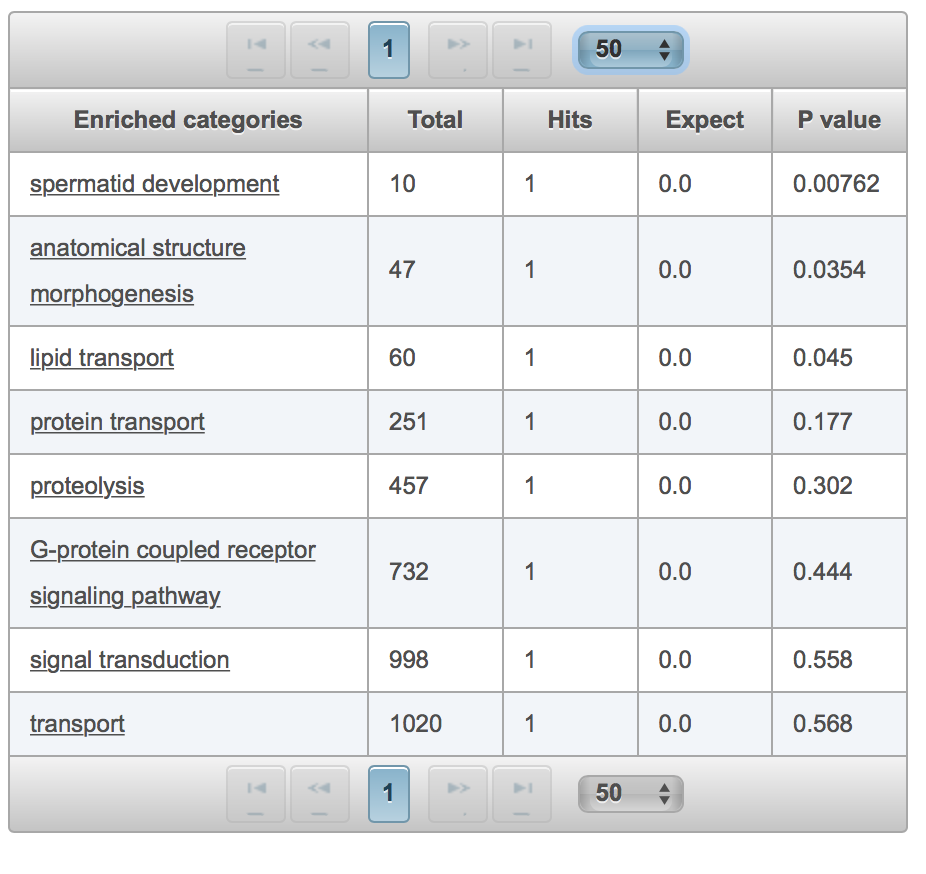

# Gene Set Enrichment Analysis (GSEA)

Gene set enrichment analysis (GSEA) is a method to identify groups of genes or proteins that may associate with certain function or disease phenotypes. The method uses statistical approaches to identify significantly enriched groups of genes.

The results in the following table summarizes outcome of GSEA where a list of enriched categories is provided from the [Gene Onotology - Biological Processes](ftp://ftp.geneontology.org/go/www/GO.doc.shtml) reference library. The total number gives the size of the reference gene set in the enriched category. The number of hits indicate the number of matches between the reference gene set and query signfificant list of genes. The P-value summarizes the degree of significance of the enriched categories and it is used for ranking results.

The expect column reflects on the number of hit of genes that will match with the enriched category if they were to be picked up randomly. The size of the genes to be selected randomly is based on the number of the query significant genes. Therefore, the smaller this number, the higher the confidence is in the summarized results of the enrichment analysis.

