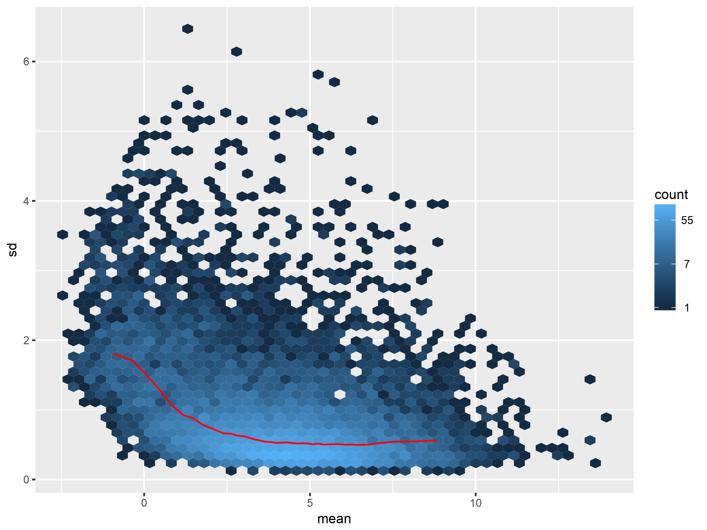

# Mean-Standard Deviation Plot of Expression Data

This plot can be used as a diagnostic tool of the quality of expression data in RNAseq. It summarizes the standard deviation versus mean measures of reads in the samples for each gene. In the following figure, one can see that genes with higher mean expression values, tend to have lower variability as indicated by the low standard deviation in the y-axis. This confirms that the good quality of expression data. However, those genes with lower abundance scores are advised to be excluded since they show large discrepncies between the different samples.

