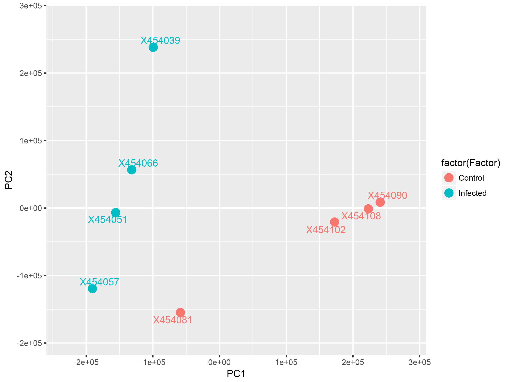
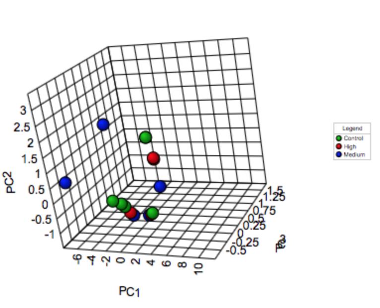

# Principle Componenet Analysis (PCA) Plot

Principal Component Analysis (PCA) is a popular technique to project multi-dimenstional data into lower dimensions to visually identify patterns. It highlightes similarties and differences between the different samples using linear transformation. PCA generates a new coordinate system such that each axes represents a linear combination of all variables. Thus, the new axes do not actually reflect any particular physical meaning except that they are chosen to maximize variance and show patterns. For more details, please refer to this [link](http://www.cs.otago.ac.nz/cosc453/student_tutorials/principal_components.pdf). 

The following figures provide a 2D and 3D view of a projection of a gene expression matrix using PCA. The colors of points indicate the different types of samples (e.g. treatment vs. control) and one can see to which extent there is a separability in the data point or an overlapping.

