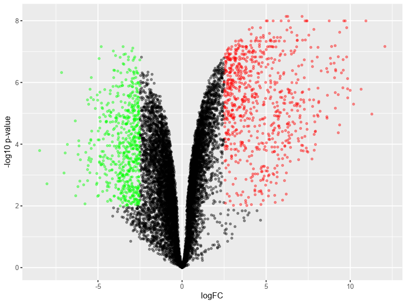

# Volcano Plot

The volcano plot is a widely used tool to summarize differential gene expression (DGE) analysis. It plots significance which is realized by concept of P-value versus fold-change (FC) on the y and x axes, respectively. The higher the significance and the larger the FC, the higher confidence we have in the highlighted genes based on the interest to examine how much the expression value differs between treatment and control groups.

A summary information about significance (i.e. y-axis of a Volcano Plot) and FC (i.e. x-axes of a volcano plot) is as follows:
- Significance: is mainly based on applying a negative log transformation to the P-Value. Therefore, the smaller the P-value, the higher the significance. P-value is a widely used metric for hypothesis testing in statistics. When comparing two groups such as treatment and control groups, a hypothesis can be established to test how measures (e.g. sample mean of treatment and control groups) in these two groups differ or comply with each other. P-value is constructed to evaluate the chance of obtaining a result that is equal to or more extreme than what is actually observed. The smaller the p-value, the higher the significance because it tells the user that the hypothesis under consideration may not sufficiently explain the observation. More details can be found [here](https://onlinecourses.science.psu.edu/statprogram/node/138/). 

- FC: is basically just a ratio of treatment vs. control scores (or vice versa). When the log scale is applied, the outcome score is the same but only with a different sign.

Based on the previous information, the group of genes of interest should be highlighted based on higher significance and higher fold change. The user has the freedom to setup thresholds of the levels to decide accepted levels of significance and fold change. 

The following volcano plot illustrates a set of differentially expressed genes. After satisfying a specific threshold of accepted significance (see y-axis), a red color is assigned to a positive fold change (or up-regulated set of gene) wheras a green color is given for the negative fold change direction (or down-regulated set of genes)

