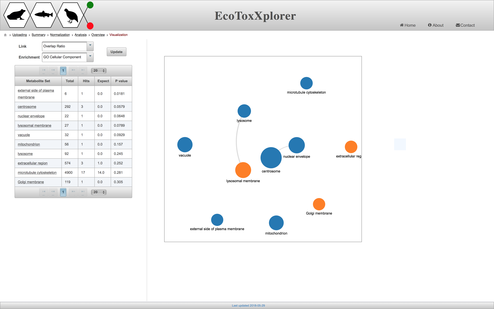

# Enrichment Network Tool

Enrichment Network provides a graph-based visualization of [enrichment analysis](background_gsea.md) of gene and protein lists. Nodes in the network represent the different enriched terms and the edges the relationship between them. The relationship is based on the number of common genes between two enriched terms. So, if they will not share any genes, there will be no edge. The nodes with same colors are clustered together (hierarchical clustering) based on the gene represented by each category.

For the "Link" option at the top left side, please choose "Overlap Ratio". Then, for the "Enrichment" option select GO Cellular Component and click on "Update" button. The following figure will be generated.

Another example of an erichment network is provided in the following snapshot. This network has a larger number of significant genes and hence, more connections between the enriched terms.

