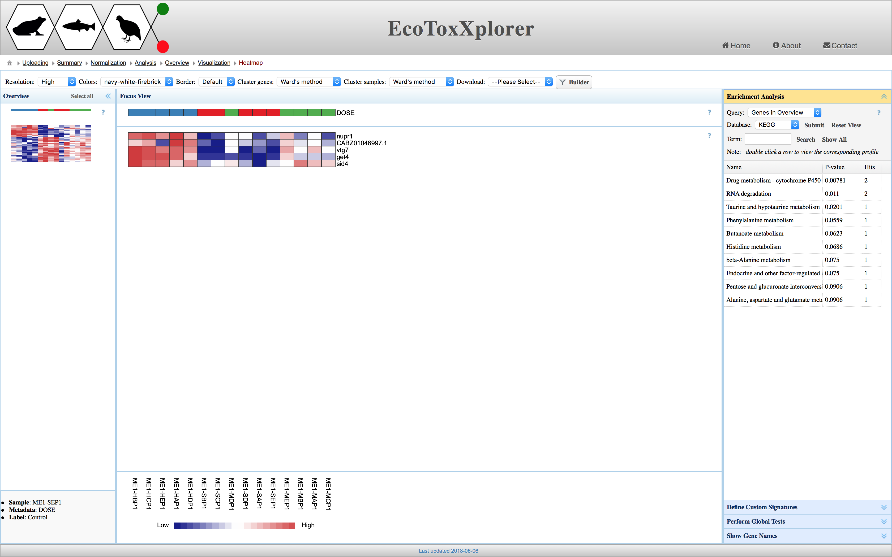

# Heatmap Tool

Heatmap tool is another tool to examine patterns in the example Minnow (ethinylestradiol) uploaded expression dataset. For background details about heatmaps, please check [this page](background_hmap.md). 

From the left panel, please select the area of interest from the heatmap plot. Then, set the "Cluster genes" and "Cluster samples" options to "Ward's Method". Other types of clustering can be tried to explore possible patterns of interest.

The following figure shows a highlighted part of the heatmap and we can again see the significance of [Vtg7 gene](https://www.ncbi.nlm.nih.gov/gene/?term=vtg7). When the dose (see the top header) refers to the treatment group as indicated by the red color, the [Vtg7 gene](https://www.ncbi.nlm.nih.gov/gene/?term=vtg7) is always down-regulated. The scale at the bottom of the page shows what the color palette indicate. At the right side of the panel, there is a tool to perform [GSEA](background_gsea.md) and examine enriched biological [pathways](background_pathway.md).

For downloading the image, please see the "Download" option at the right side of the top panel.

For more details on the different options in the Heatmap Tool of EcoToxXplorer, please check this [file](heatmaps_tutorial.pdf).

### Next step: [Enrichment Network Tool](enrichment_network_tool.md)
### Previous step: [Heatmap Tool](heatmap_tool.md)
