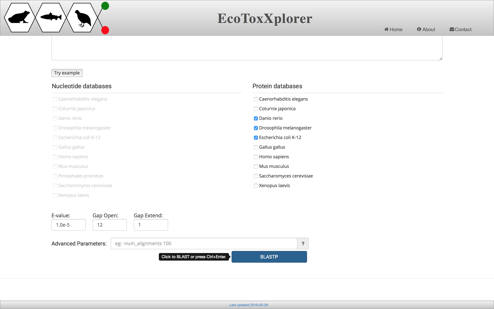
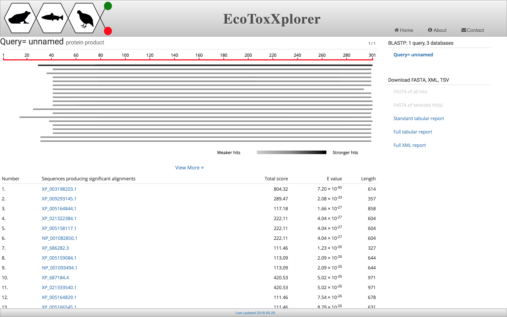
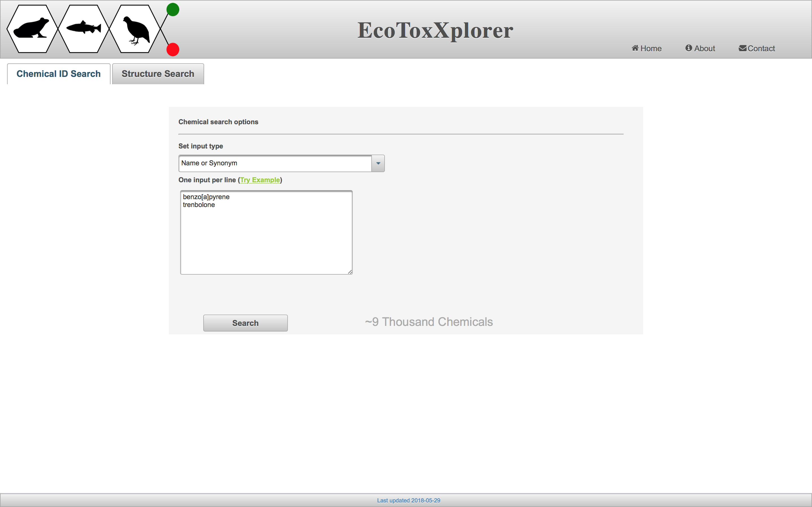
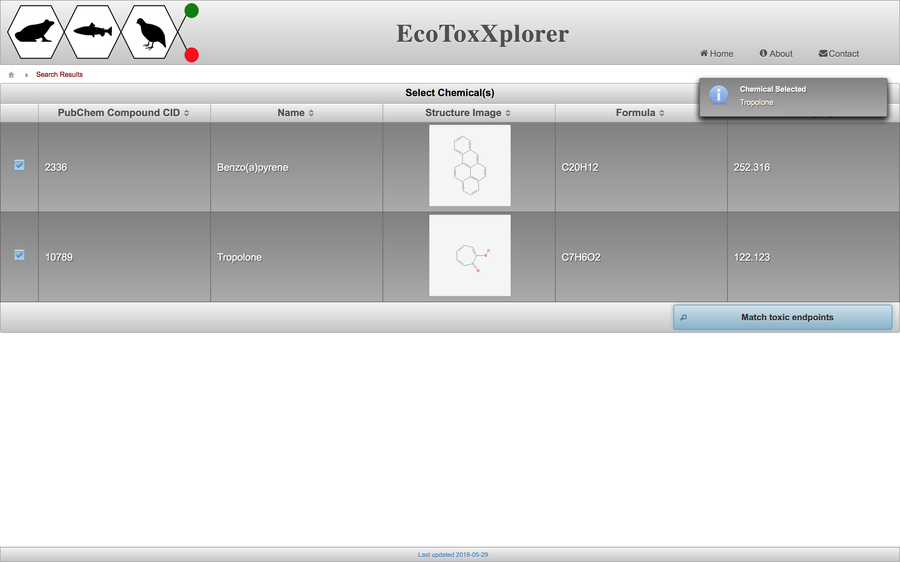
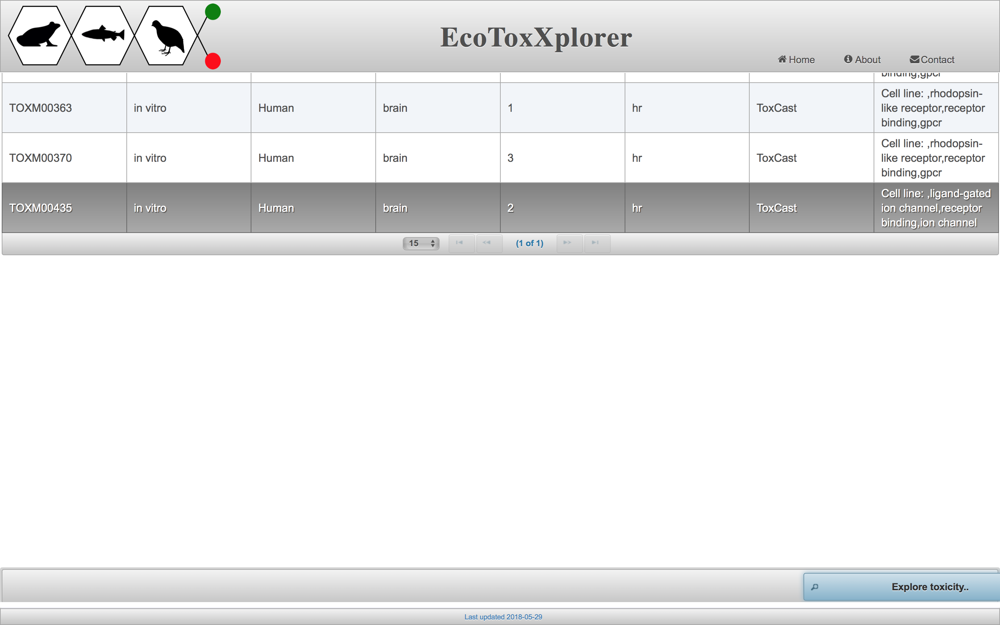
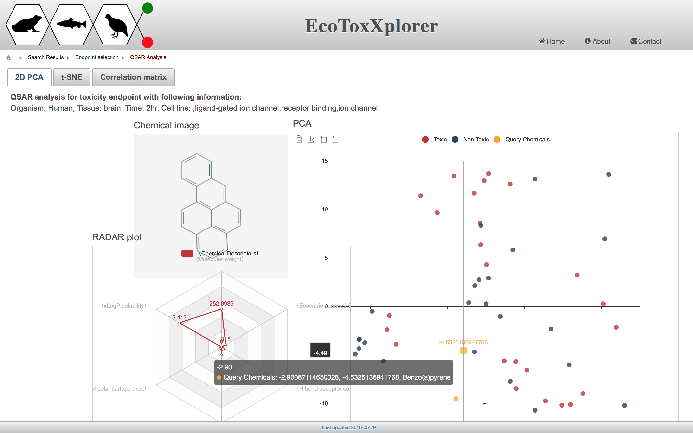
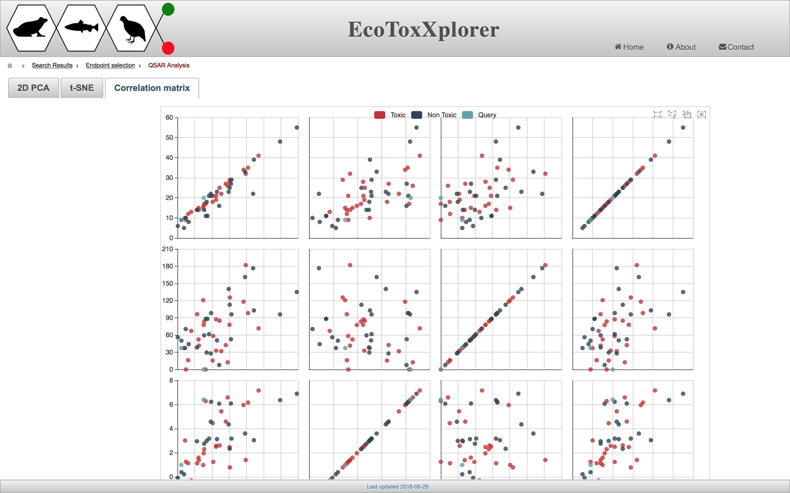

## Other Utilities Tutorial

# [Sequence search](http://www.ecotoxxplorer.ca/faces/tools/BLAST.xhtml)

Sequence search is a tool that enables researchers for comparing query sequences with pre-built reference libraries of different species given certain thresholds. The tool is based on the well-known BLAST (Basic Local Alignment Search Tool) algorithm. It accepts all primary biological sequences such as the nucleotides of DNA sequences and the amino-acid sequences of proteins.

# [Chemical search](http://www.ecotoxxplorer.ca/faces/tools/ChemSearch.xhtml)

High-throughput screening (HTS) experiments provide a valuable resource that reports biological activity of numerous chemical compounds relative to their molecular targets. Quantitive structure-activity relationship analysis and modeling enables exploring the activity status of input query chemicals such as toxic vs. non-toxic. [Chemical search](http://www.ecotoxxplorer.ca/faces/tools/ChemSearch.xhtml) tool in [EcoToxXplorer](http://www.ecotoxxplorer.ca) provides a workflow to explor activities of about 9,000 chemicals and reference [ToxCast assays](https://www.epa.gov/chemical-research/toxicity-forecaster-toxcasttm-data).

