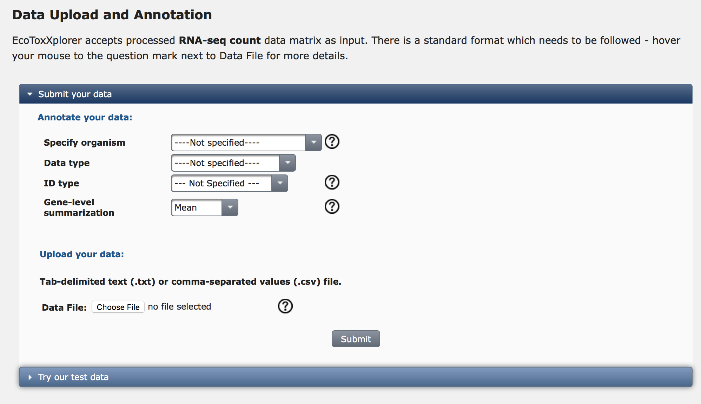
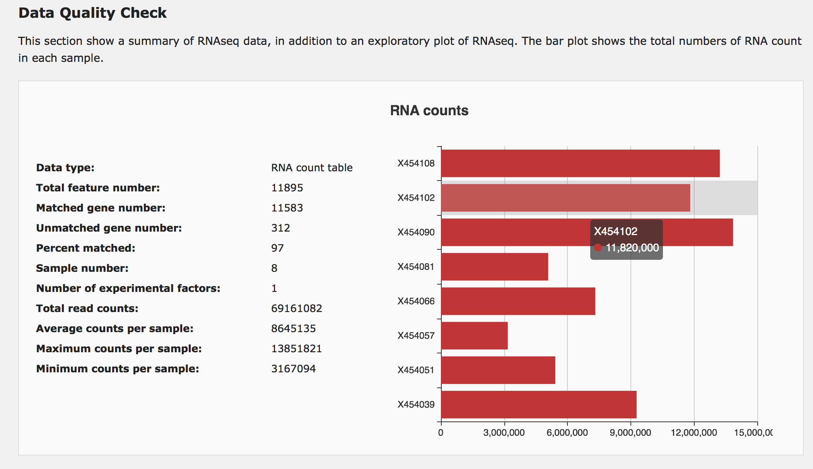
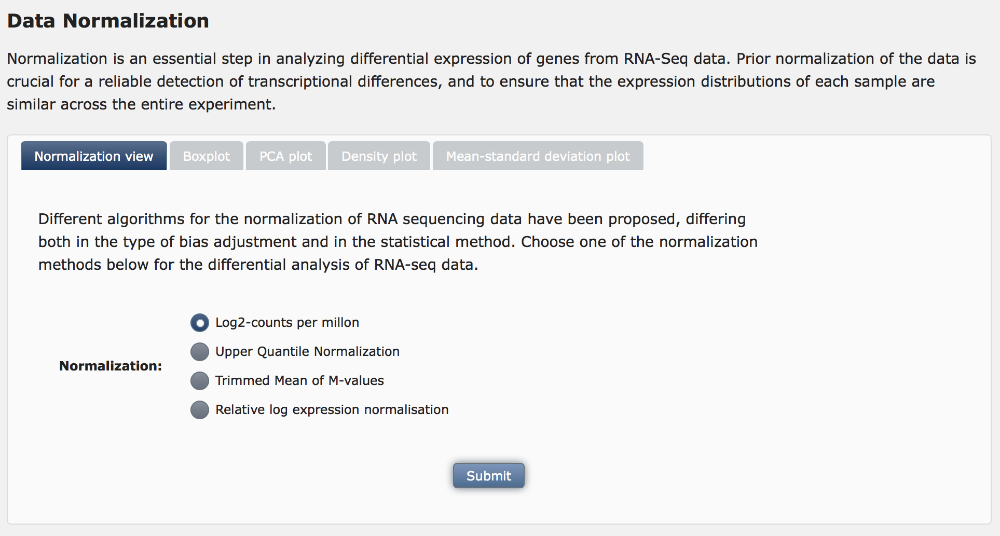
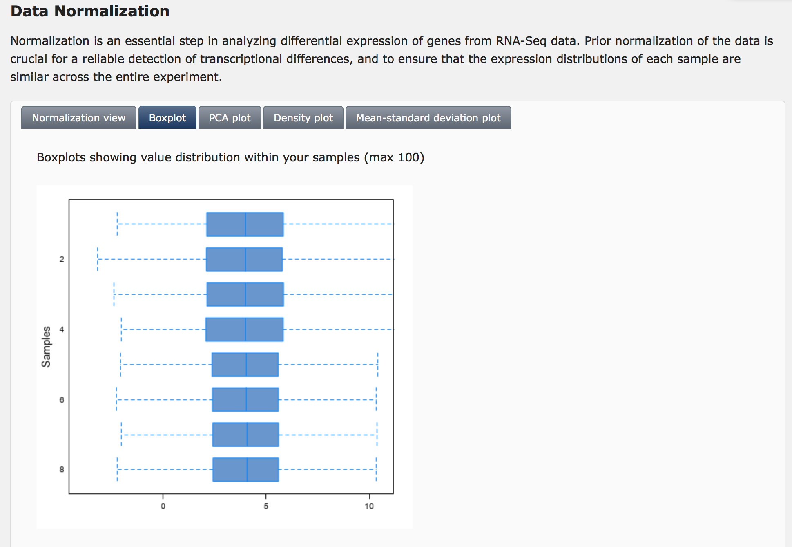

## RNAseq Analysis Tutorial

[EcoToxXplorer](http://www.ecotoxxplorer.ca) is a comprehensive web application for -OMICs data analysis and interpretation towards risk assessment of chemicals. 

To make the data analysis process as simple and as painless as possible, EcoToxXplorer uses a step-wise data processing pipeline that guides users through all the major data processing steps beginning with data-type selection, formatting, “cleansing” and normalization. 

### DATA UPLOADING, PROCESSING AND NORMALIZATION
#### Data preparation and uploading


#### Quality check
Prior to conducting any kind of data analysis in transcriptomics, it is important to assess the overall data quality and to see if there are any obvious outliers. As there are no obvious outliers based on the above procedures, we will redo our data normalization to create some “artificial” outliers - for illustration purposes only. Click the “normalization” hyperlink on the navigation tree to return to the “Data Normalization” page. Make sure to set the Sample normalization as “none”, choose “Auto scaling” for Data scaling, and click the “Submit” button. The previously normalized data is now overwritten by the new data containing several artificial outliers.


#### Data normalization
In this case, we will select “Normalization by sum” for sample normalization, “None” for data transformation and “Auto scaling” for data scaling. After selecting these options, click the “Submit” button. The purpose of data normalization is to reduce any systematic bias within a given data set and to improve overall data consistency so that meaningful biological comparisons can be made. EcoToxXplorer offers three types of normalization, transformation or scaling. Normalization aims to make each sample (row) comparable to each other. Three different data transformation methods are offered, no transformation, log transformation and cube-root transformation. Scaling aims to make each variable comparable to each other. This procedure is useful when variables are of very different orders of magnitude. The effect of data normalization is summarized graphically in Fig. XYZ. The horizontal box plots on the top show the distributions of individual variables, while the bottom plots show the overall data distribution based on kernel density estimation. Users should compare the graphical summary before and after normalization to guide them towards choosing the methods that work best with their data. In this case, we consider the data to be properly normalized because of the appearance of the characteristic “bell-shaped” distribution. Click the “Submit” button. 



#### Statistical analysis of normalization results


Markdown is a lightweight and easy-to-use syntax for styling your writing. It includes conventions for

```markdown
Syntax highlighted code block

# Header 1
## Header 2
### Header 3

- Bulleted
- List

1. Numbered
2. List

**Bold** and _Italic_ and `Code` text

[Link](url) and 
```

### Support or Contact

Having trouble with Pages? Check out our [documentation](https://help.github.com/categories/github-pages-basics/) or [contact support](https://github.com/contact) and we’ll help you sort it out.
