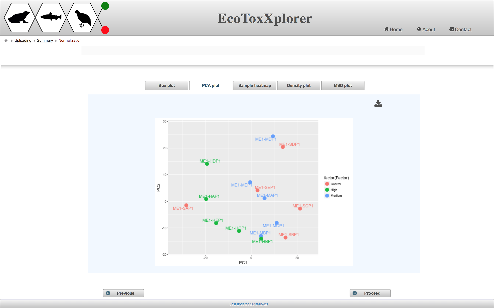

# Data Filtering & Normalization

#### Data normalization
In this case, we will select “Normalization by sum” for sample normalization, “None” for data transformation and “Auto scaling” for data scaling. After selecting these options, click the “Submit” button. The purpose of data normalization is to reduce any systematic bias within a given data set and to improve overall data consistency so that meaningful biological comparisons can be made. EcoToxXplorer offers three types of normalization, transformation or scaling. Normalization aims to make each sample (row) comparable to each other. Three different data transformation methods are offered, no transformation, log transformation and cube-root transformation. Scaling aims to make each variable comparable to each other. This procedure is useful when variables are of very different orders of magnitude. The effect of data normalization is summarized graphically in Fig. XYZ. The horizontal box plots on the top show the distributions of individual variables, while the bottom plots show the overall data distribution based on kernel density estimation. Users should compare the graphical summary before and after normalization to guide them towards choosing the methods that work best with their data. In this case, we consider the data to be properly normalized because of the appearance of the characteristic “bell-shaped” distribution. Click the “Submit” button. 

