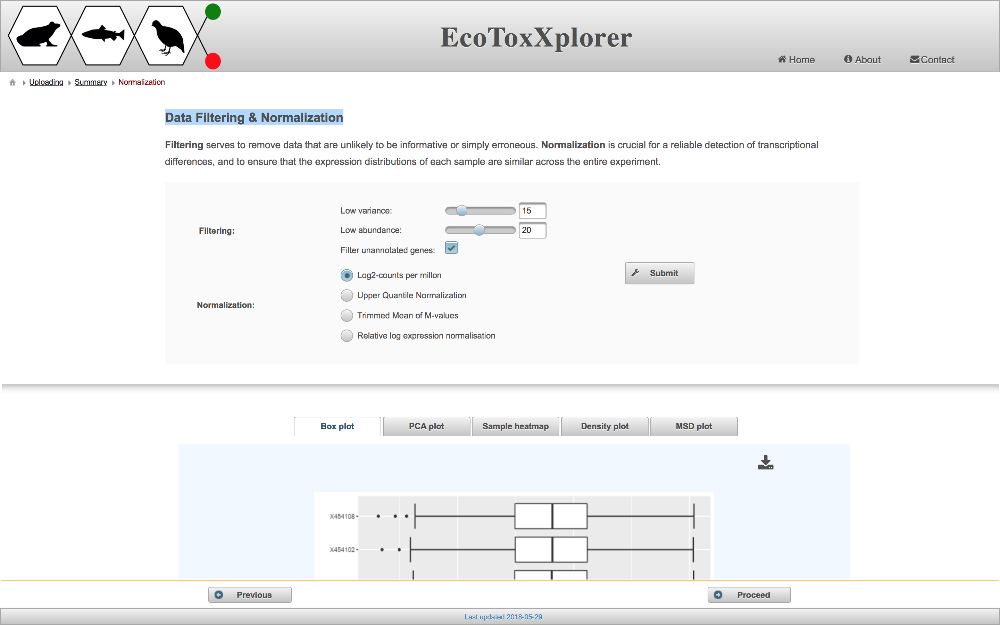
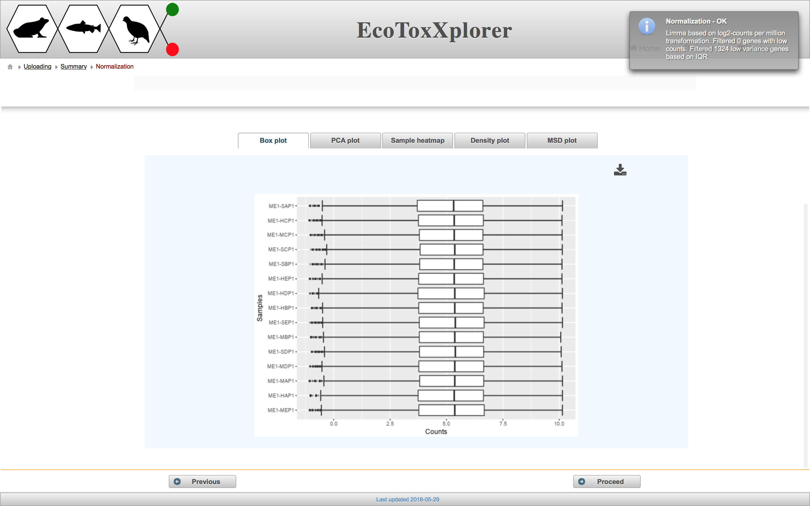
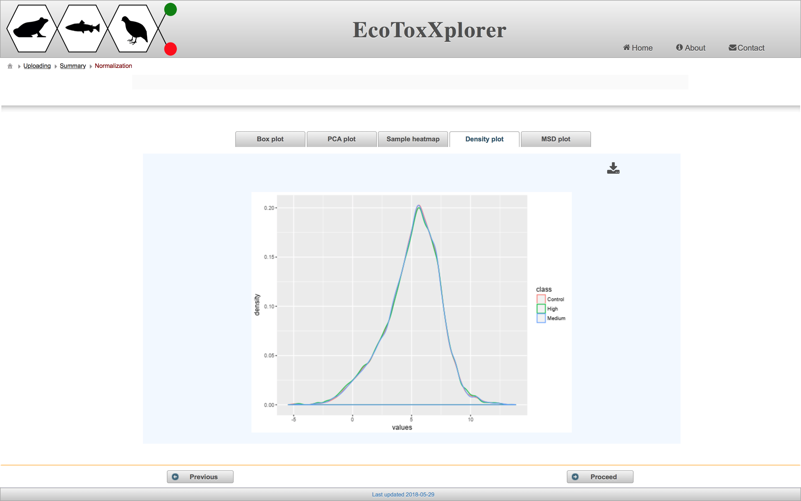

# Data Filtering & Normalization

After viewing the raw data, the next step is to filter and normalize to increase the suitability for downstream statistical analyses. 

#### Data filtering
The purpose of filtering is to remove any genes that are uninteresting or unreliable. "Uninteresting genes" are genes whose expression values do not change across different samples, and thus have very low variance. Genes are ranked by their variance from low to high, and users can exclude a certain percentile of genes with the lowest variance by adjusting the "Low variance" slider. "Unreliable genes" are genes with low count numbers. This is a problem because the fit of the statistical models used for differential expression analysis becomes unstable with lower count numbers. Users can exclude genes with count numbers below a certain threshold by adjusting the "Low abundance" slider. Filtering out genes with low variance or count numbers improves the statistical power of the differential expression analysis, thus giving more differentially expressed genes without greatly increasing the number of false positives. 

#### Data normalization
The purpose of data normalization is to reduce any systematic technical bias within a given data set and to improve overall data consistency so that meaningful biological comparisons can be made. After normalization, samples are more comparable to each other. EcoToxXplorer offers four types of normalization, all of which are established methods with high performance, and are accepted by the bioinformatics community. The effects of data normlization are summarized graphically by five different plots. Users should compare the graphical summary before and after normalization to guide them towards choosing the methods that work best with their data. If you scroll down to the boxplot image, you can see that the samples are much more comparable to each other than before normalization.

In this case, we consider the data to be properly normalized because of the appearance of the characteristic “bell-shaped” distribution. Click the “Proceed” button. 

### Next step: [Differential Expression Analysis](rnaseq_DEG.md)
### Previous step: [Data Summary and Quality Check](rnaseq_qc.md)
