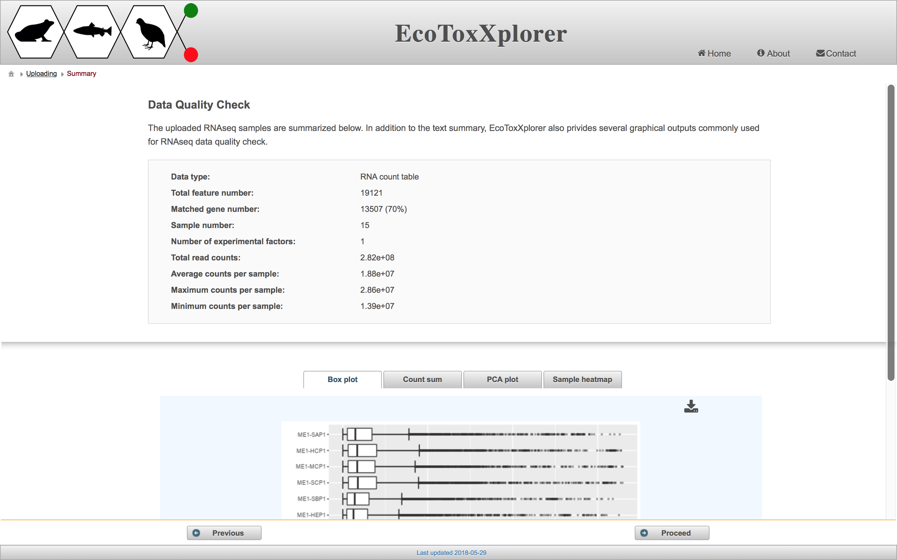
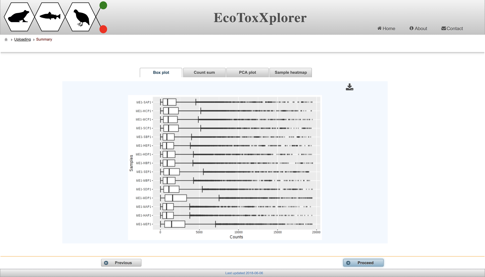
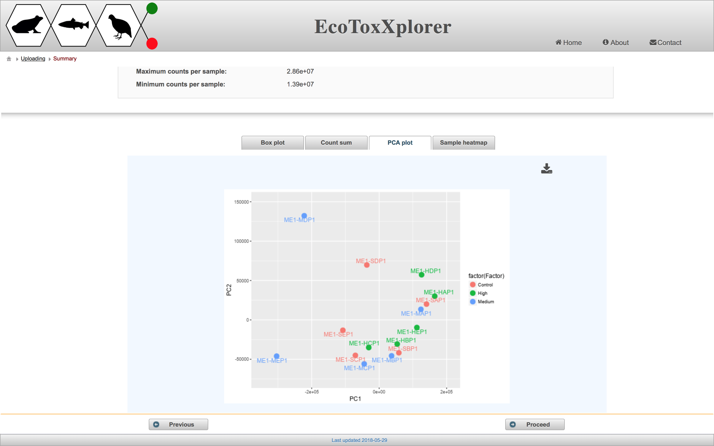
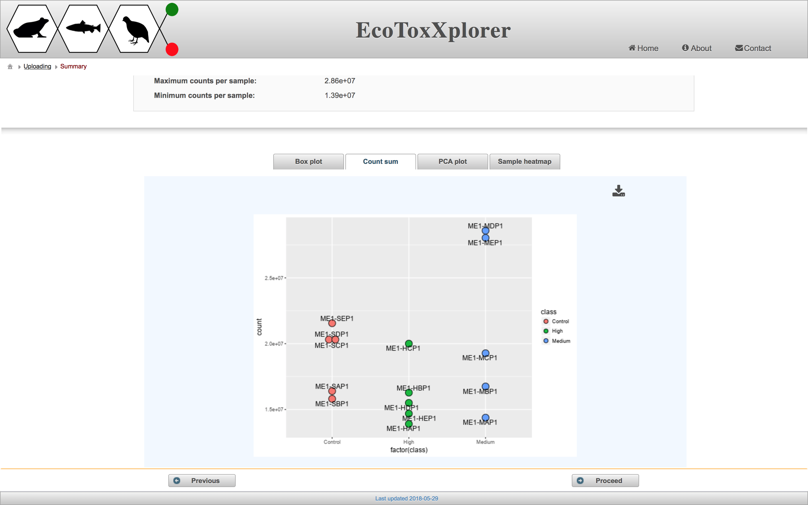

# Data Summary and Quality Check

#### Quality check
Prior to conducting any kind of data analysis in transcriptomics, it is important to assess the overall data quality and to see if there are any obvious outliers. As there are no obvious outliers based on the above procedures, we will redo our data normalization to create some “artificial” outliers - for illustration purposes only. Click the “normalization” hyperlink on the navigation tree to return to the “Data Normalization” page. Make sure to set the Sample normalization as “none”, choose “Auto scaling” for Data scaling, and click the “Submit” button. The previously normalized data is now overwritten by the new data containing several artificial outliers.

