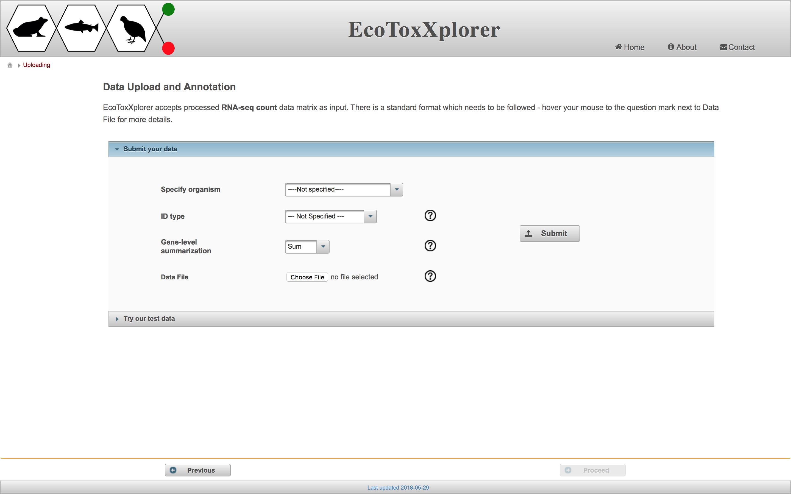
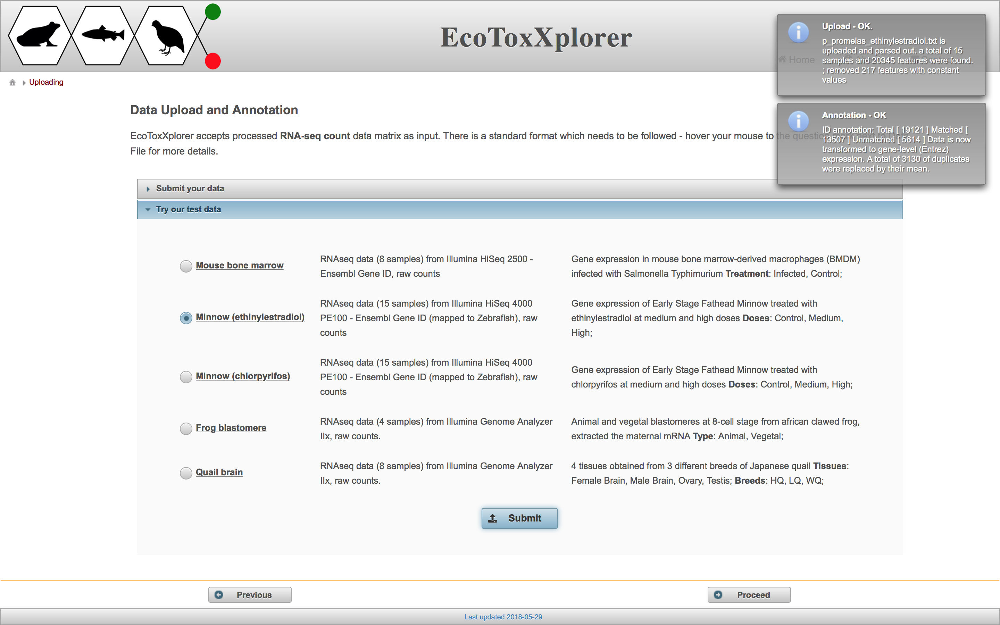

# Data Upload and Annotation

In a regular analysis session where a user is analyzing their own data, the first step would be to specify the organism, gene ID type, and the gene-level summarization, and to upload a properly formatted tab-delimited text file (.txt) containing the raw counts matrix. In this tutorial, we will use an example dataset accessible from the "Try our test data" button.

From the available example datasets, select "Minnow (ethinylestradiol)".

### Next step: [Data Summary and Quality Check](rnaseq_qc.md)
